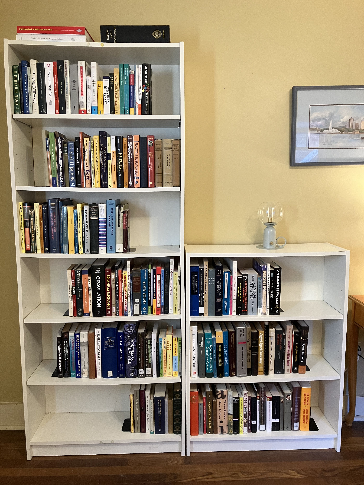
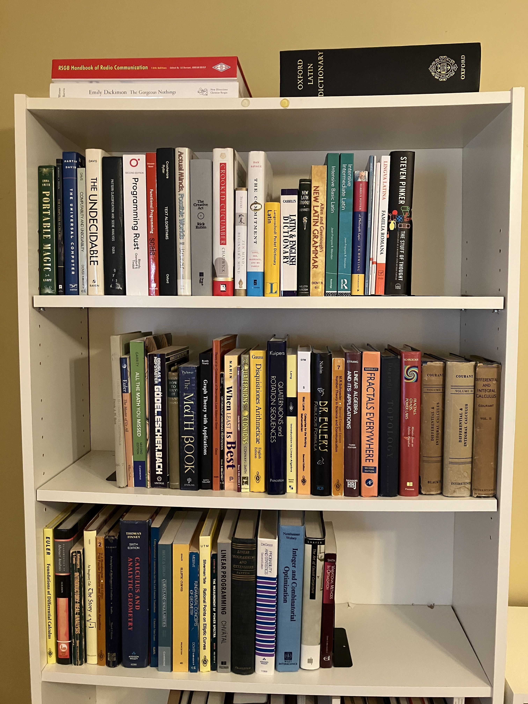
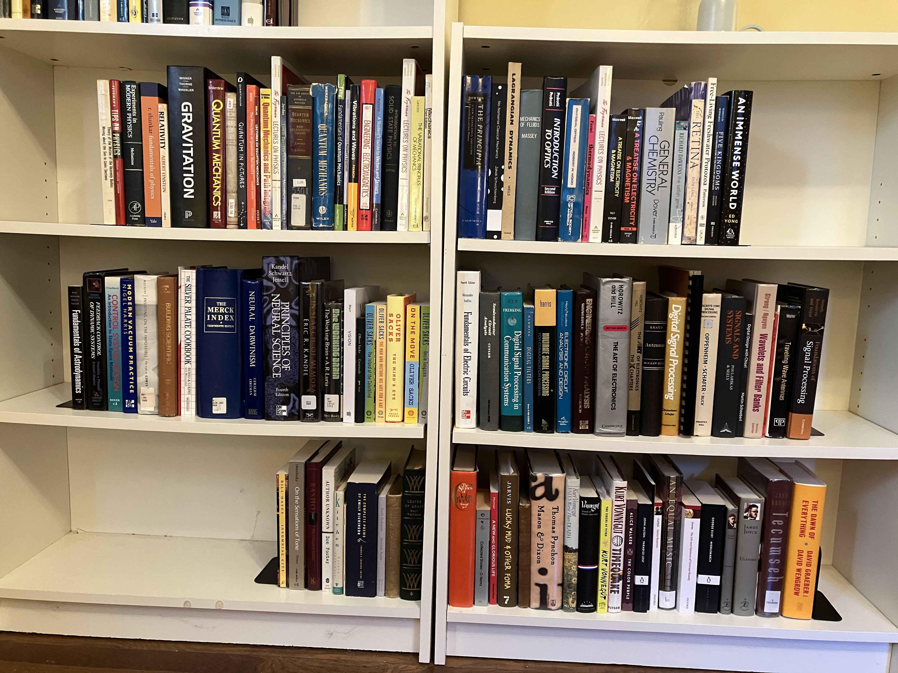

[repo]: https://github.com/ttdoucet/image

## Books

Most of these are substantially above average.

Dewey Decimal is a good way to organize books, because books that are used together
tend to be near each other.  I don't apply stickers though.
Right-click on a picture for full resolution.

<figure>
  
  <figcaption>
    <em>
      Bookshelves next to the desk.
    </em>
  </figcaption>
</figure>

 

<figure>
  
  <figcaption>
    <em>
      Oversize on top.  First shelf has 000's to 400's.  Second and third shelves have 510 Math.
    </em>
  </figcaption>
</figure>

 

<figure>
  
  <figcaption>
    <em>
       Spanning two adjacent horizontal shelves is 500 Science, and below that 600 Applied Science.
       And on the bottom shelf, 700's and 800's Art and Literature.
       Most of <a href="/literature">literature</a> is not on these shelves.
    </em>
  </figcaption>
</figure>

 

[literature]: /literature
