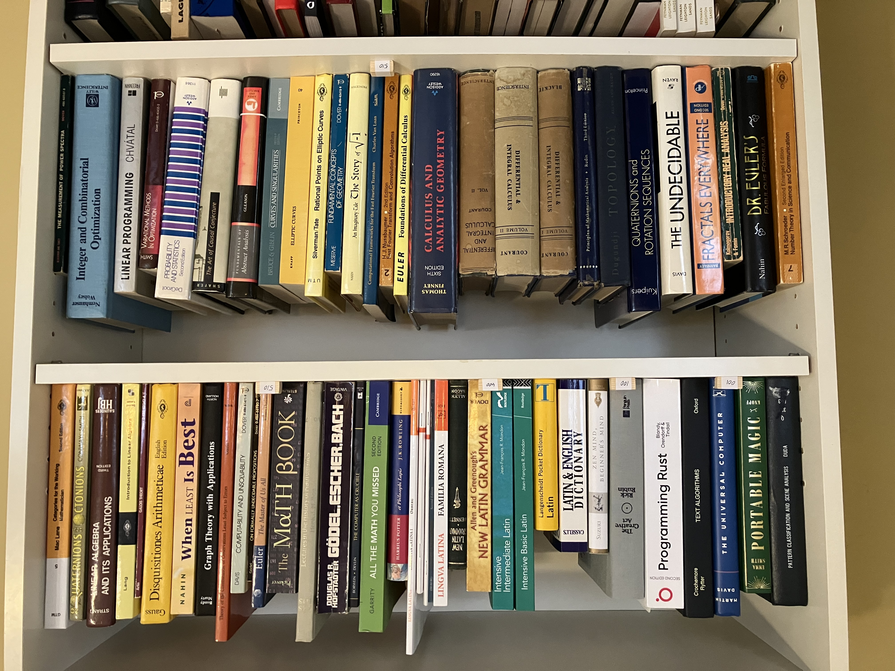
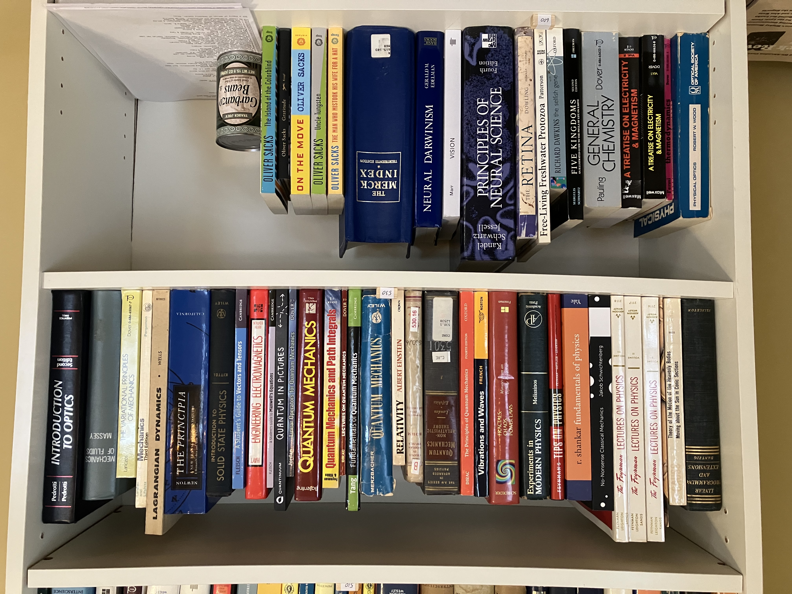
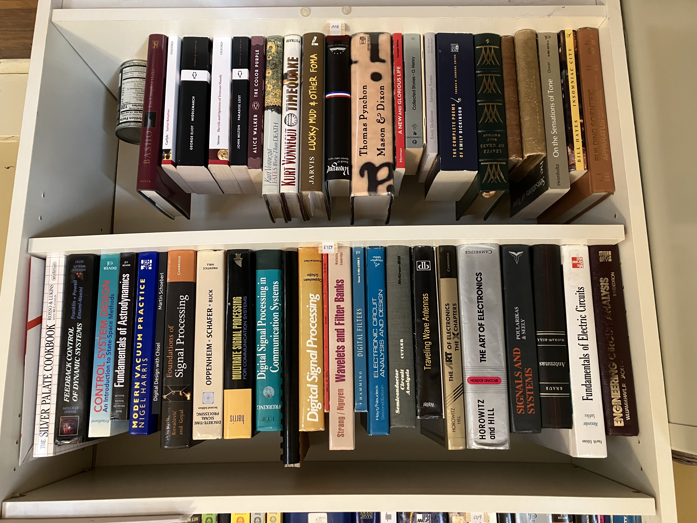
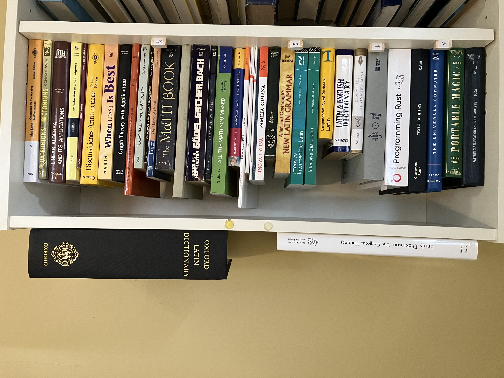

[repo]: https://github.com/ttdoucet/image

## Books

Most of these are substantially above average.

Dewey Decimal is a good way to organize books, because books that are used together
tend to be near each other.  I don't apply stickers, but instead indicate the shelf
locations with little blocks.  Right-click on a picture for full resolution.

<figure>
  
  <figcaption>
    <em>A few computer books, some Latin books, then mathematics.</em>
  </figcaption>
</figure>

 

<figure>
  
  <figcaption>
    <em>Physics and other sciences, technology.</em>
  </figcaption>
</figure>

 

<figure>
  
  <figcaption>
    <em>Electronics, arts, literature, poetry.</em>
  </figcaption>
</figure>

 

<figure>
  
  <figcaption><em>Oversize.</em></figcaption>
</figure>

