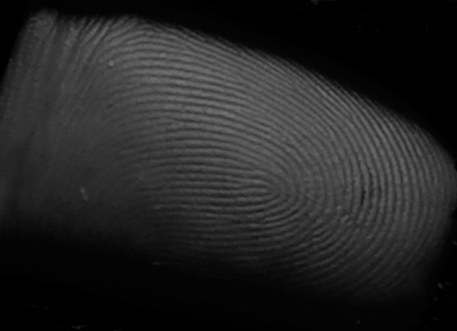
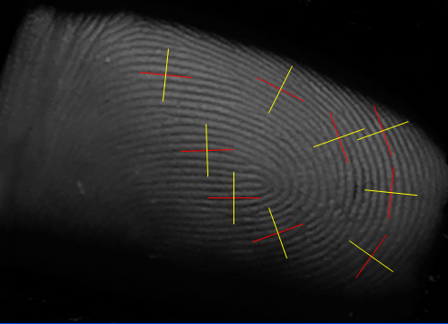
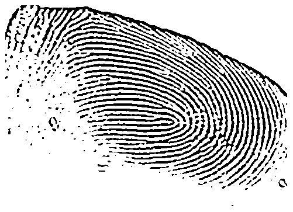
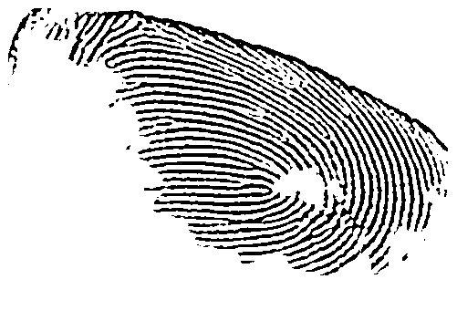
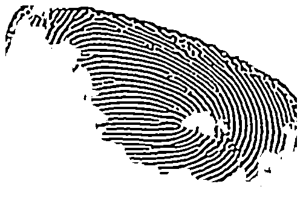

[repo]: https://github.com/ttdoucet/image

# Fingerprints

I wrote a simple but fast image processing library to facilitate
investigations in image enhancement.  The library is written in
C# and runs under the .NET framework.

The generic library code, along with code for a simple GUI to feed images and see the results
of various computations, is in this [repo][Repo].

All of the computations below involve separable filter kernels and
should be easily implementable at video speeds on embedded hardware.

<figure>
  
  <figcaption>Original snapshot of finger showing fingerprint.</figcaption>
</figure>

<figure>
  
  <figcaption>Gradient computation showing tangents & normals.</figcaption>
</figure>

<figure>
  
  <figcaption>Gaussian blur followed by Laplacian, then
              a specialized thresholding.
  </figcaption>
</figure>

<figure>
  
  <figcaption>Strength of computed orientation field
              allows us to mask off areas of the
              image that are not of interest.
  </figcaption>
</figure>

<figure>
  
  <figcaption>
    This stable image results from repeatedly
    feeding back the output image as input.
  </figcaption>
</figure>

That the image is a fixed point of this iterated function system
suggests that it might be useful to make contraction mappings
based on the original input, as a completely different way to
proceed.
