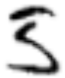

Is it a five written in a hurry?  Or is it a three with a touch of Asian calligraphy?
Inquiring minds want to know.

To me it looks like a three, but I can flip a mental switch and it looks like nothing
other than a five.

I spent a good month working on the venerable [MNIST] problem to identify hand-written digits.
My [model][code] ended up getting 99.82% accuracy on the test set, which I think is really good.

Along the way I became a fan of PyTorch, and switched to it from TensorFlow.

But the stuff I see in the alpha version of TensorFlow
2.0 is pretty neat---in particular the explicit representation of
differentiation in tf.GradientTape and the economy of expression
afforded by tf.function.

Someday maybe I will be able to write machine learning models directly in
NumPy, without the dialectal distractions of PyTorch, and with gradients just where
I want them as with TF2.  Will it come to pass?

The [code] for my model, and a [runnable Python notebook] which demonstrates it,
are freely available.  Comments are welcome!

PS: My model thinks it is a three also.

[MNIST]: http://yann.lecun.com/exdb/mnist/
[code]: https://github.com/ttdoucet/mnist
[runnable Python notebook]: https://colab.research.google.com/github/ttdoucet/mnist/blob/master/mnist.ipynb
