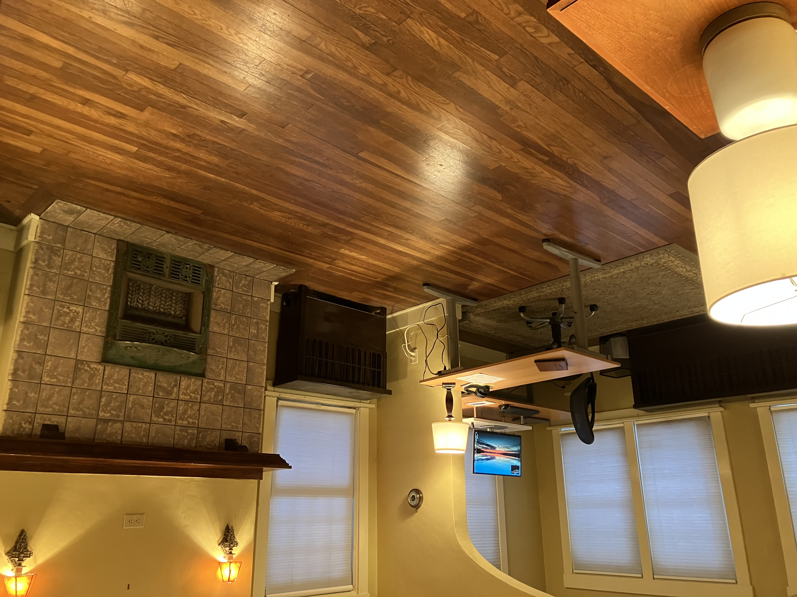
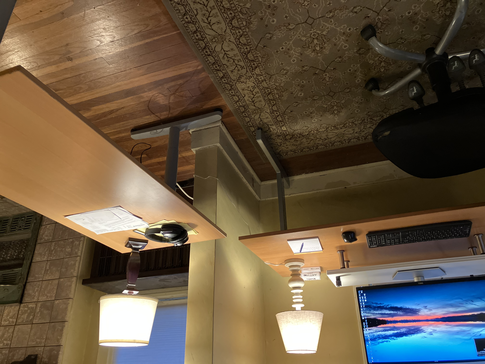
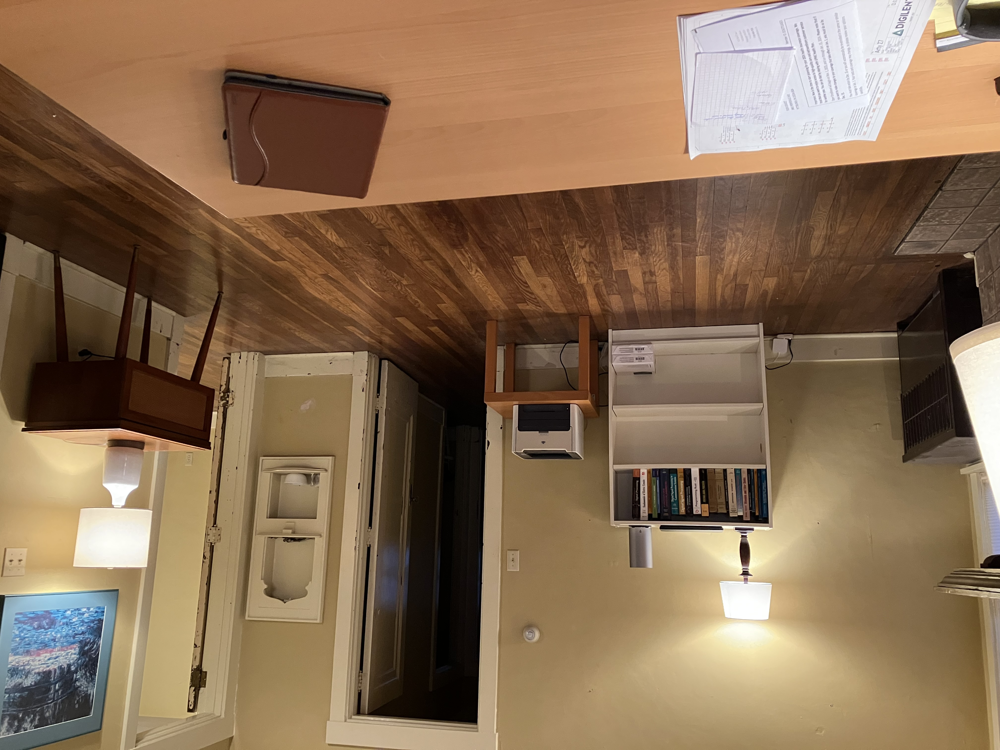
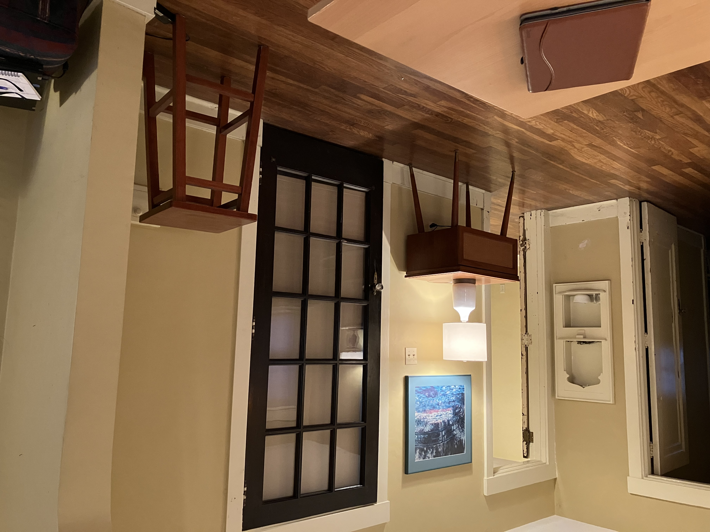
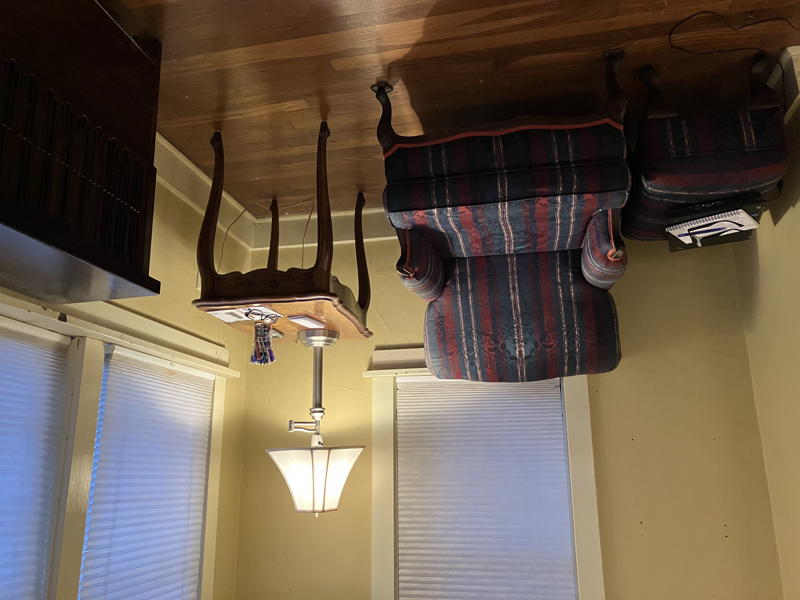
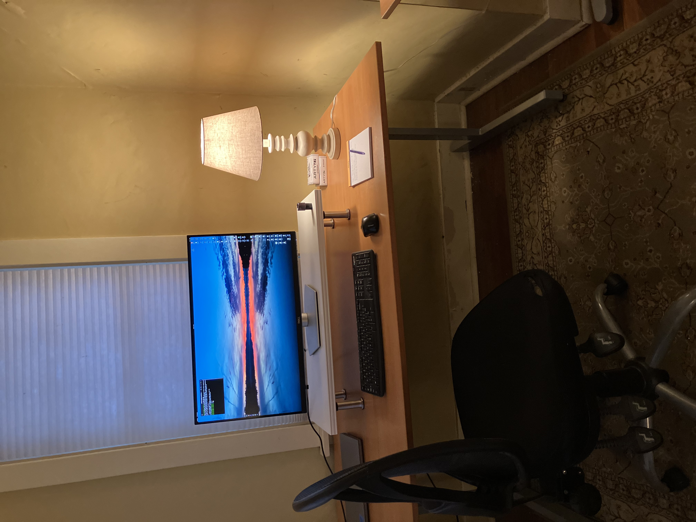
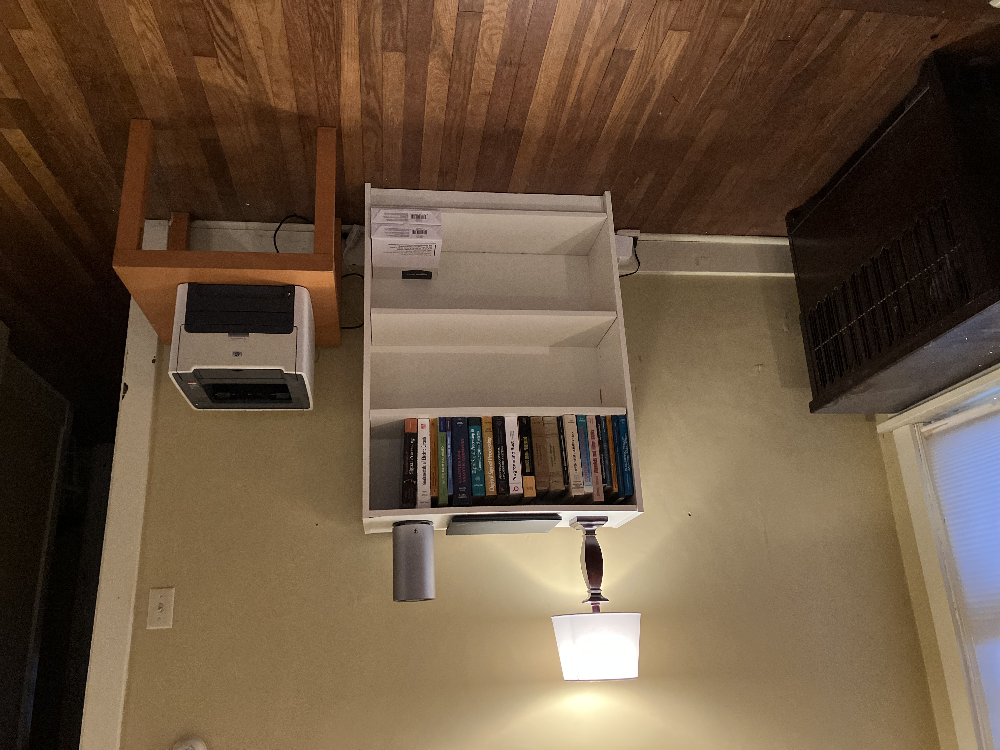
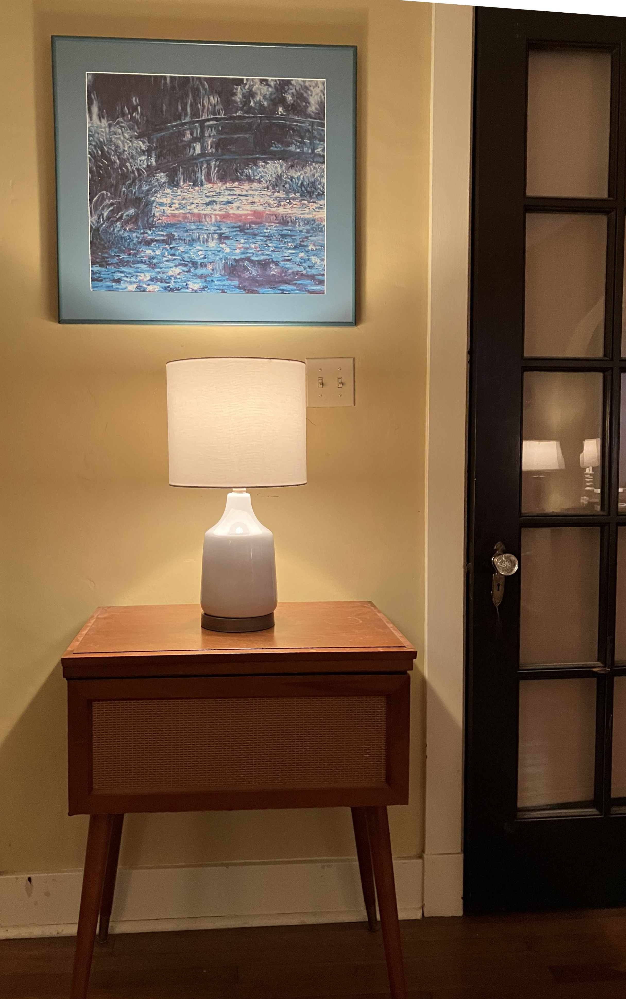

[repo]: https://github.com/ttdoucet/image

## Office

<figure>
  
  <figcaption><em>Walking into the office from an adjoining room</em>.</figcaption>
</figure>

 

<figure>
  
  <figcaption>
    <em>Computer desk and writing desk.</em>
  </figcaption>
</figure>

 

<figure>
  
  <figcaption><em>View from the writing desk.</em></figcaption>
</figure>

 

<figure>
  
  <figcaption><em>Another view from the writing desk.</em></figcaption>
</figure>

 

<figure>
  
  <figcaption>
    <em>Chair across sunroom from computer desk.</em>
  </figcaption>
</figure>

 

<figure>
  
  <figcaption>
    <em>Monitor stand and mostly wireless.</em>
  </figcaption>
</figure>

 

<figure>
  
  <figcaption><em>Printer, 5G Internet, books.</em></figcaption>
</figure>

 

<figure>
  
  <figcaption>
    <em>Sewing machine from 1962 tucked in there.</em>
  </figcaption>
</figure>

