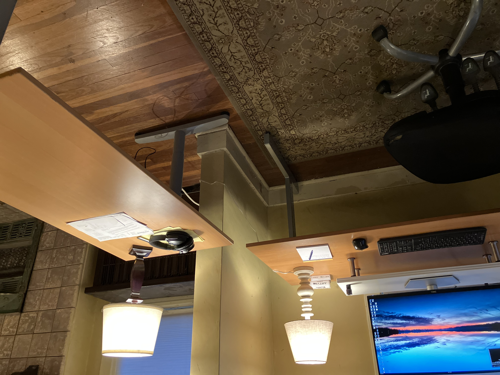

[repo]: https://github.com/ttdoucet/image

# Office

<figure>
  
  <figcaption>Walking into the office from an adjoining room.</figcaption>
</figure>

<figure>
  
  <figcaption>
    Computer desk and writing desk.
  </figcaption>
</figure>

<figure>
  
  <figcaption>View from the writing desk.</figcaption>
</figure>

<figure>
  
  <figcaption>Another view from the writing desk.</figcaption>
</figure>

<figure>
  
  <figcaption>
    Chair across sunroom from computer desk.
  </figcaption>
</figure>

<figure>
  
  <figcaption>
    Monitor stand and mostly wireless.
  </figcaption>
</figure>

<figure>
  
  <figcaption>Printer, 5G Internet, books.</figcaption>
</figure>

<figure>
  
  <figcaption>
    Sewing machine from 1962 tucked in there.
  </figcaption>
</figure>

