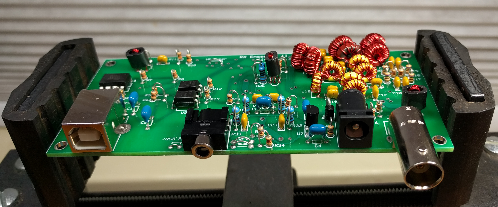
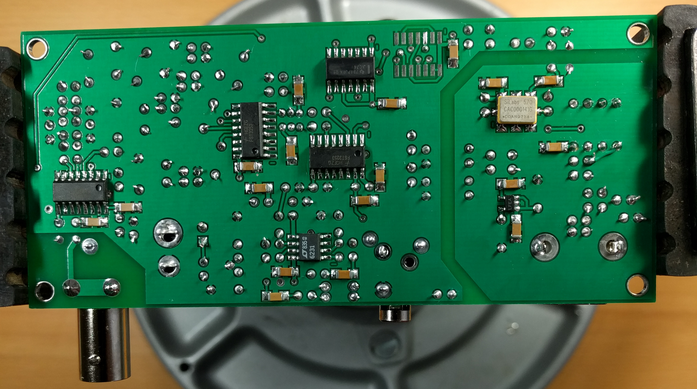
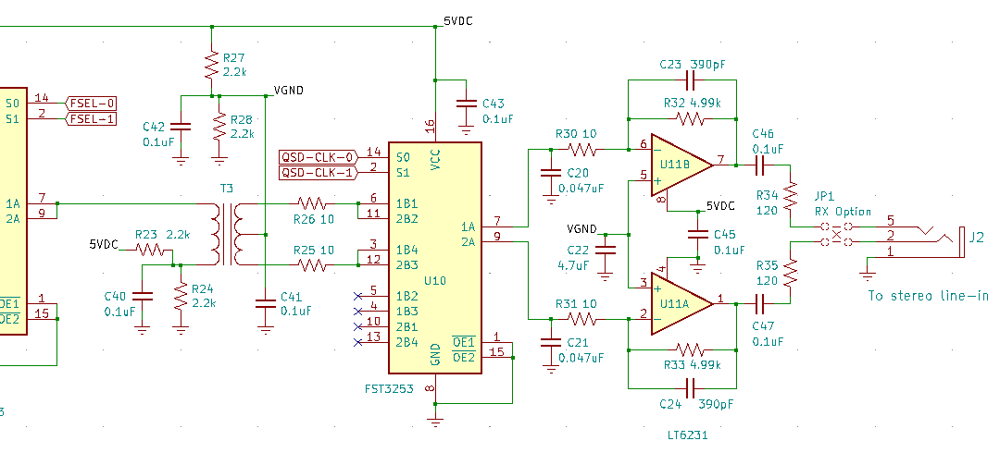
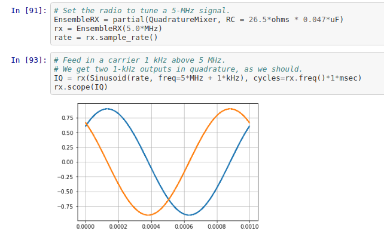
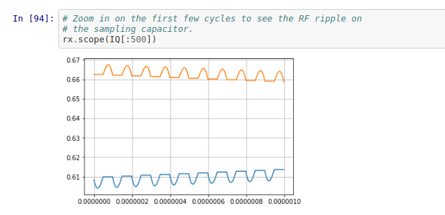

# SoftRock

Tony Parks at Five Dash sold a wonderful software-defined radio kit, the SoftRock Ensemble II RX.
I enjoyed building it and then analyzing in some depth the design of several aspects of the radio.

## Construction

It is not too difficult to build.  The toroids took me a while, but I enjoyed doing them
and also enjoyed doing the three broadband transformers on the bobbins.  It's nice to know
that you can do all the inductance you need yourself for HF.

There are about 18 surface mount bypass capacitors on the bottom of the board, which are pretty
easy to do with only a little practice.  Most of the ICs are also surface mount.  Most are also
easy, but a couple are tricky---the very small 3.3-volt regulator caused me the most trouble.  But
there were no serious problems with them and it is a skill well worth developing.

The rest of the parts are all through hole and easy to solder.  The part placement is surprisingly
tight, especially in the filter section.  Most of the resistors are small 1/6-watt units and all
resistors are mounted vertically.

I found the quality of the circuit board, the parts, and the selection of parts to be very
impressive.  I also like that there is not a polarized capacitor anywhere on the board.

 

## Circuit

Tony had a perfectly good schematic on his site, but I decided to take this
opportunity to learn [KiCad].  So I installed it, went through the tutorials, then learned
how to use the schematic editor to enter the schematic for this radio.  The project
is available in this [repo][softrock-kicad], and here is a [PDF][schematic] of the resulting schematic.

The heart of the radio is the quadrature sampling detector.  In the circuit snippet immediately below,
the QSD is formed by the operation of the multiplexer U10 and the sampling capacitors C20 and C21, in
conjunction with the op amp gain and low-pass filter stage.

The circuit is subtle and clever.  RF from the filtered 50-ohm system comes in at the
left of transformer T3, and is transformed down to 12.5 ohms by the 2-to-1 transformer.
It then passes through either one of the 10-ohm resistors R26 or R25, depending on which
branch of switch U10 is closed at that moment, and then it goes to either the top or
bottom sampling capacitor, again depending on which switch is closed at that moment.

At each moment, one and only one path conducts through U10.
The QSD clock signals at S0 and S1 cause the multiplexer to close one
contact at a time in the following sequence: top of T3 to top
capacitor C20, then top of T3 to bottom capacitor C21, then bottom of
T3 to the top capacitor, then bottom of T3 to the bottom capacitor.

If the input is a sinusoid at a given frequency and the radio is to be tuned
exactly to that center frequency, the local oscillator operates at four
times this center frequency, so that one cycle of the desired signal is
sampled four times, in the manner just described.

If the top cap C20 sees the first peak, say, of the sinewave, then it
will see it again half a cycle later, this time from the bottom half
of T3.  Because of the center tap and biasing, these two quarters do not cancel,
they reinforce.  Similarly, in this situation the bottom cap C21 would
see the two zeros of the sinusoid, again additively.  In this case,
the two outputs would converge in a few cycles to DC values for the
two "I" and "Q" outputs of the detector.

If the signal is 1 kHz away from the center frequency, say, then the I and Q
outputs would be 1-kHz sinusoids, ninety-degrees out of phase ("in quadrature").

In order to check my understanding and to see exactly what is happening at
the sampling capacitors C20 and C21, I created a [Python notebook][qsd]
to analyze the circuit.

It traces the voltage at the sampling capacitors by applying first principles,
the differential equations that describe the non-linear commutating RC circuit,
fed by a voltage source with the above-indicated impedances.  The code ended
up being pretty simple and it worked out well, and was a lot of fun.

The notebook shows the I & Q signals in quadrature, as expected, and also the small
amount of RF ripple present on them (which would be further attenuated
by the low-pass filter of the op amp gain stage).  It also shows the transient
responses and settling time for the circuit.  I was able to analyze
the approximate bandwidth of the sampling system directly, which can be a little
tricky in a nonlinear circuit.  The notebook also investigates how the QSD
behaves when the LO is operated at 1/3 the normal frequency, which is done
sometimes.  (I believe Tony's SoftRock Lite kits do this.)

There is also a second [Python Notebook to analyze the bandpass filters][bpf]
used in the receiver front end.

I encourage you to clone the repos and run them for yourself if you're interested---lots
of fun!

## Reading

To gain more insight into how a quadrature detector works, it is worthwhile to
read the informative [patent document][patent] for the Tayloe detector, now
expired.  Additional insight can be had by reading this often-cited but
very hard to find Motorola app note, [AN-534][appnote], Commutating Filter Techniques.

## Plans

One reason I learned KiCad and did the schematic of the radio is that that, ultimately,
I'd like to investigate variations on this circuit.  I plan to learn the PC board layout
part of KiCad, and then do a board spin on a simplified version of the circuit, which I could
then build and experiment with.  If that comes to pass I will update this page.

Todd, AE3K

[front]: docs/01-front.jpg
[top]: docs/02-top.jpg
[bottom]: docs/03-bottom.jpg
[patent]: docs/US6230000.pdf
[appnote]: docs/AN-534.pdf
[schematic]: docs/softrock-bw.pdf
[softrock-kicad]: https://github.com/ttdoucet/softrock-schematic
[QSD]: docs/QSD.png
[bpf]: https://nbviewer.jupyter.org/github/ttdoucet/impedance/blob/master/impedance.ipynb
[qsd]: https://nbviewer.jupyter.org/github/ttdoucet/qsd-mixer/blob/master/mixer_nb.ipynb
[KiCad]: https://www.kicad.org
