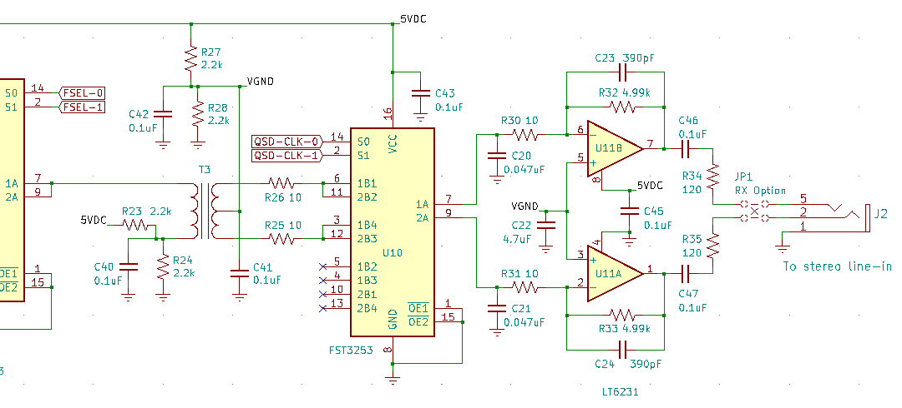

# SoftRock

Tony Parks at [Five Dash] sells a wonderful software-defined radio kit, the SoftRock Ensemble II RX.
I enjoyed building it and then analyzing in some depth the design of several aspects of the radio.

* [Patent document][patent]
* Motorola [app note][appnote]
* Bandpass filter [notebook][bpf]
* Quadrature sampling detector [notebook][qsd]

## Construction

 

## Circuit

Tony has a perfectly good schematic on [his site][Five Dash], but I decided to take this
opportunity to learn [KiCad].  So I installed it, went through the tutorials, then learned
how to use the schematic editor to enter the schematic for this radio.  The project
is available in this [repo][softrock-kicad], and here is a [PDF][schematic] of the resulting schematic.

The heart of the radio is the quadrature sampling detector.  In the circuit snippet immediately below,
the QSD is formed by the operation of the multiplexer U10 and the sampling capacitors C20 and C21, in
conjunction with the op amp gain and low-pass filter stage.

The circuit is subtle and clever.  RF from the filtered 50-ohm system comes in at the
left of transformer T3, and is transformed down to 12.5 ohms by the 2-to-1 transformer.
It then passes through either one of the 10-ohm resistors R26 or R25, depending on which
branch of switch U10 is closed at that moment, and then it goes to either the top or
bottom sampling capacitor, again depending on which switch is closed at that moment.

At each moment, one and only one path conducts through U10.
The QSD clock signals at S0 and S1 cause the multiplexer to close one
contact at a time in the following sequence: top of T3 to top
capacitor C20, then top of T3 to bottom capacitor C21, then bottom of
T3 to the top, then bottom of T3 to the bottom.

Because of the center tap of T3 and the biasing of the circuit, a
sinusoidal....

[front]: docs/01-front.jpg
[top]: docs/02-top.jpg
[bottom]: docs/03-bottom.jpg
[patent]: docs/US6230000.pdf
[appnote]: docs/AN-534.pdf
[schematic]: docs/softrock-bw.pdf
[softrock-kicad]: https://github.com/ttdoucet/softrock-schematic
[QSD]: docs/QSD.png
[bpf]: https://github.com/ttdoucet/impedance/blob/master/impedance.ipynb
[qsd]: https://github.com/ttdoucet/qsd-mixer/blob/master/mixer_nb.ipynb
[Five Dash]: http://fivedash.com
[KiCad]: http://kicad-pcb.org
