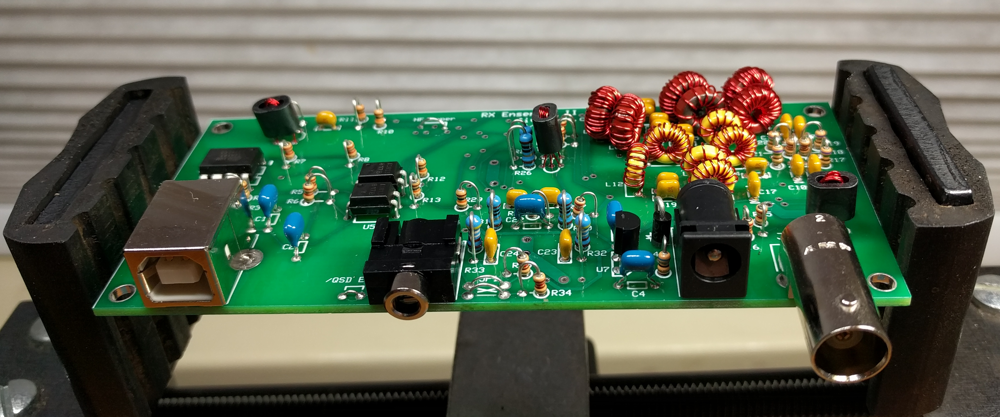
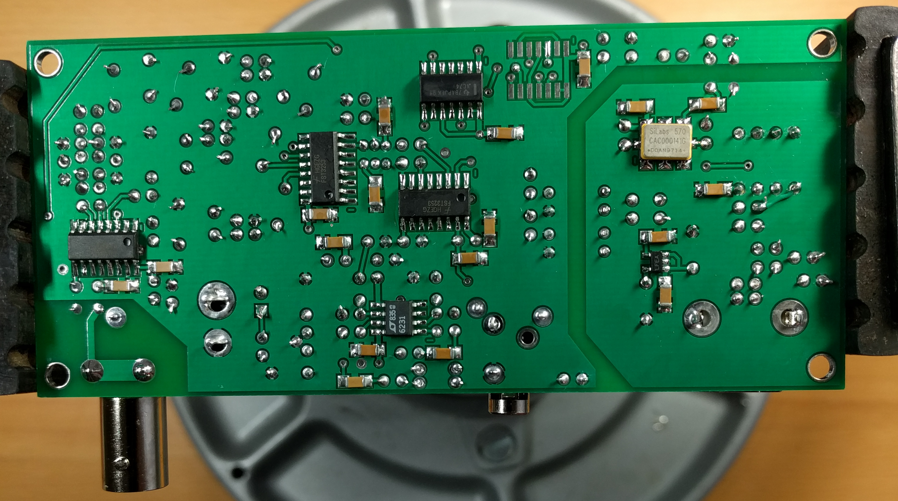

# SoftRock

Tony Parks at [Five Dash] sells a wonderful software-defined radio kit, the Ensemble II RX.
I enjoyed building it and then analyzing in some depth the design of several aspects of the radio.

* [Patent document][patent]
* Motorola [app note][appnote]
* [Schematic][schematic]
* Bandpass filter [notebook][bpf]
* Quadrature sampling detector [notebook][qsd]
* KiCad schematic [repo][softrock-kicad]

## Construction

[front]: docs/01-front.jpg
[top]: docs/02-top.jpg
[bottom]: docs/03-bottom.jpg
[patent]: docs/US6230000.pdf
[appnote]: docs/AN-534.pdf
[schematic]: docs/softrock-bw.pdf
[softrock-kicad]: https://github.com/ttdoucet/softrock-schematic

[bpf]: https://github.com/ttdoucet/impedance/blob/master/impedance.ipynb
[qsd]: https://github.com/ttdoucet/qsd-mixer/blob/master/mixer_nb.ipynb
[Five Dash]: http://fivedash.com
